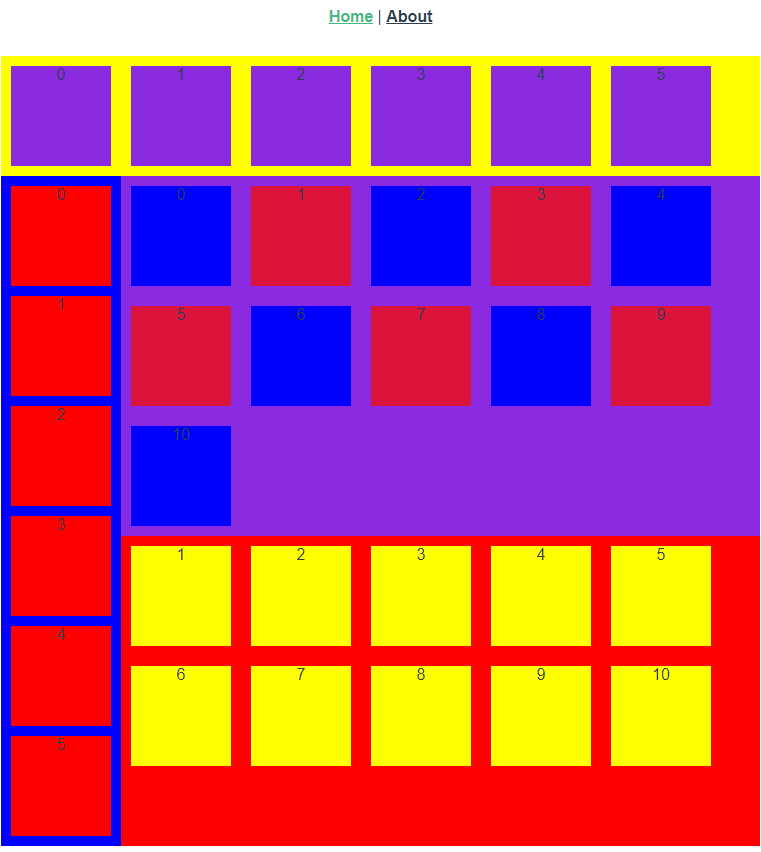

# vue-focusable

基于 Vue 的 焦点组件,既键盘导航组件（keyboard navigation/spatial navigation）

### 参考：
[vue-spatialnavigation](https://github.com/twcapps/vue-spatialnavigation)

### 配置
- `tag`：必填，所要渲染的标签，如`div`
- `clickable`：选填，鼠标是否可点击/悬浮聚焦，默认为`true`
- `className`：选中状态下的 class 样式名称，默认为`focus`
- `setupKeyBoardEvents`：设置键盘事件

```typescript
import Focusable, { SpatialNavigationOptions ,NavigationServiceDirection } from "../../dist/"
Vue.use(Focusable, <SpatialNavigationOptions>{
  tag: "div",
  clickable: true,
  setupKeyBoardEvents(el) {
    document.addEventListener("keydown", (e: KeyboardEvent) => {
      // 查找
      const keyCode = e.keyCode ? e.keyCode : e.charCode ? e.charCode : e.which;
      if (el) {
        switch (keyCode) {
          case 38:
            el.spatialNavigationAction(NavigationServiceDirection.Up)
            break;
          case 40:
            el.spatialNavigationAction(NavigationServiceDirection.Down)
            break;
          case 37:
            el.spatialNavigationAction(NavigationServiceDirection.Left)
            break;
          case 39:
            el.spatialNavigationAction(NavigationServiceDirection.Right)
            break;
          case 13:
            el.spatialNavigationAction(NavigationServiceDirection.Enter)
            break;
        }
      }
    });
  }
})
```
### 属性
当 `left`、`right`、`up`、`down` 为`AUTOFOCUS`时，跳转到下一个默认：具有`data-default` / `default`的焦点元素
|  属性名                     | 说明  | 
|  ----                       | ----  |
| `id`                        | 指定组件`id`：默认随机 | 
| `data-default` / `default`  | 是否为默认焦点 | 
| `data-left` / `left`        | 指定触发`left`事件时所要导航到的`id` |
| `data-right` / `right`      | 指定触发`right`事件时所要导航到的`id` |
| `data-up` / `up`            | 指定触发`up`事件时所要导航到的`id` |
| `data-down` / `down`        | 指定触发`down`事件时所要导航到的`id` |
### 事件
事件参数：
```js
{
    isDefault: boolean,
    isFocus: boolean
}
```
|  属性名     | 说明  | 
|  ----      | ----  |
| `focus`  | 触发`focus`事件时 | 
| `blur`  | 触发`blur`事件时 | 
| `click`  | 触发`click`事件时 | 
| `left`     | 触发`left`事件时 |
| `right`    | 触发`right`事件时 |
| `up`       | 触发`up`事件时 |
| `down`     | 触发`down`事件时 |
### 手动跳转
跳转到指定的 `id`
```typescript
    import { navigationService } from "../../dist/";
    let el = navigationService.getFocusElementById("button2");
    if (el) el.focus()
```
### 组件使用
来自`example`目录下的[HOME]("./example/src/views/Home.vue")
```html
<template>
  <div class="home">
    
    <!-- <HelloWorld msg="Welcome to Your Vue.js + TypeScript App"/> -->
    <div class="df fw yellow">
        <Focusable down="left1"  class="item blueviolet">{{0}}</Focusable>
        <Focusable v-for="i in 5" :key="i" class="item blueviolet" default>{{i}}</Focusable>
    </div>
    <Focusable id="f1" class="df crimson">
      <!-- <template>
        <div :style="{'color':scope.isFocus?'red':'#333'}">1111111{{scope}}</div>
      </template> -->
          <Focusable class="blue">
              <Focusable id="left0" right="right2"  class="item red">{{0}}</Focusable>
              <Focusable :id="'left' + i" right="right2" v-for="i in 5" :key="i" class="item red">{{i}}</Focusable>
          </Focusable>
           <Focusable class="df dfc red">
               <div>
                <Focusable class="df fw blueviolet">
                    <Focusable left="AUTOFOCUS" down="AUTOFOCUS" class="item blue">{{0}}</Focusable>
                    <div v-for="i in 10" :key="i">
                        <Focusable :id="'right' + i" v-if="i%2 == 0" class="item blue">{{i}}</Focusable>
                        <div  v-if="i%2 != 0" class="item crimson">{{i}}</div>
                    </div>
                </Focusable>
               </div>
               <Focusable class="df fw red">
                   <Focusable v-for="i in 10" :key="i" class="item yellow" default>{{i}}</Focusable>
               </Focusable>
           </Focusable>
    </Focusable>
  </div>
</template>
```
### 演示

